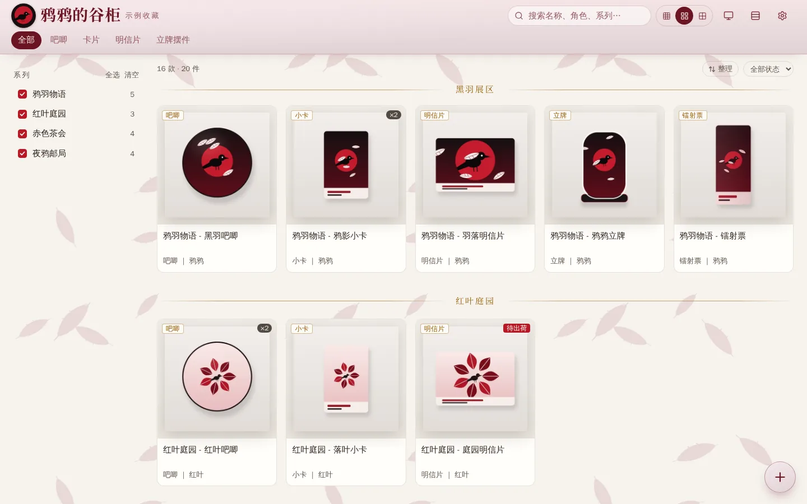
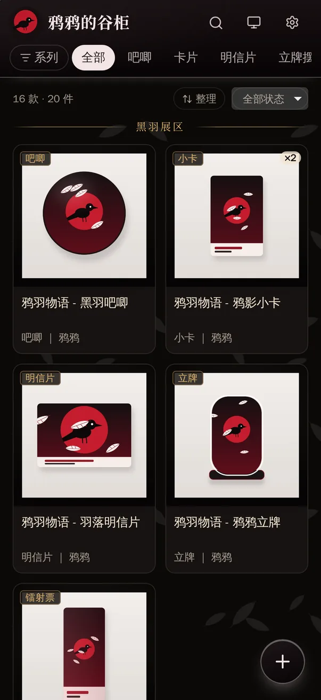
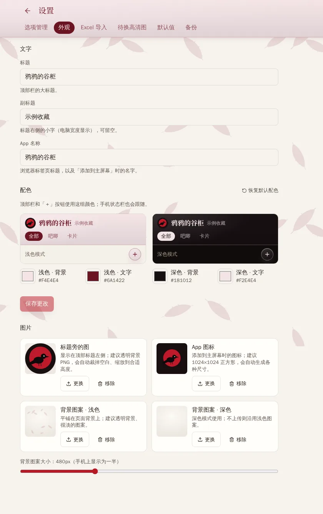
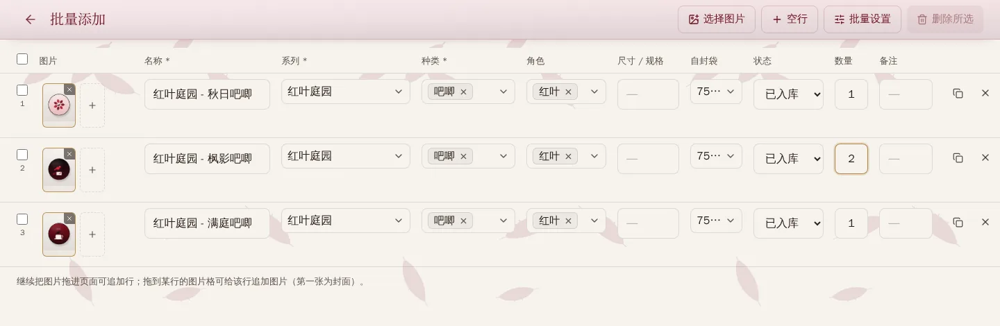
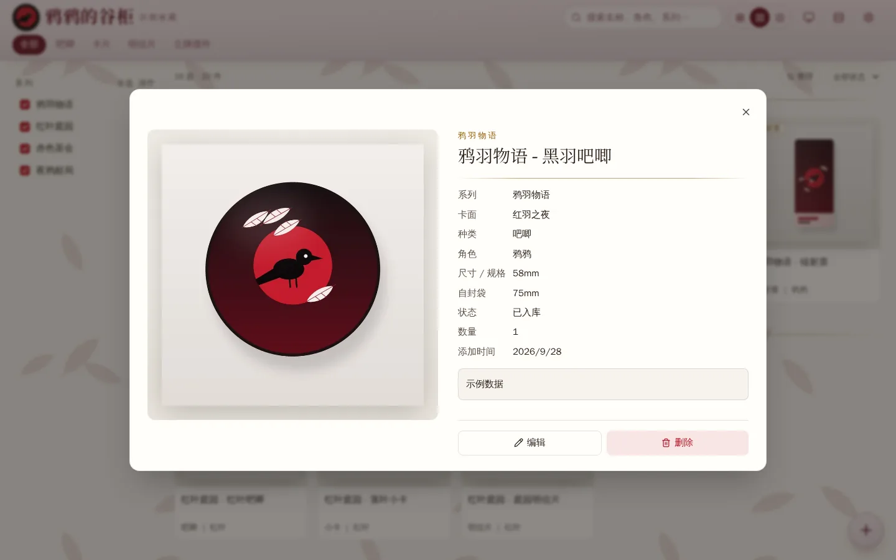
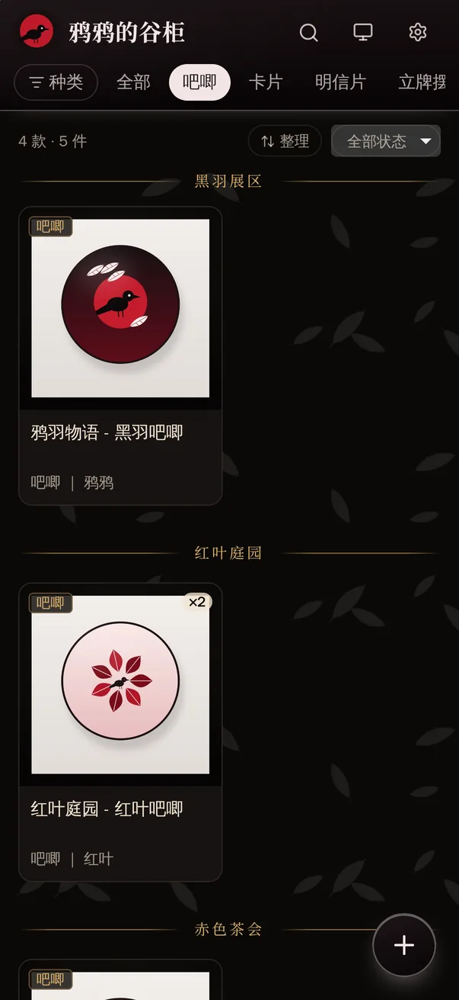

# goods-shelf

A self-hosted display cabinet for anime merchandise (谷子 / *guzi*): badges, photo cards, postcards, acrylic
stands and more. Browse your collection like a small personal museum on a phone or a computer, and install it
as an app. Made for one person or one household on a home or private network.

<p>
  
  
</p>

<sub>All series, characters and item photos in the screenshots are generated examples. The title 「鸦鸦的谷柜」, the red and
black colours, the crow logo and the feather background are an example appearance set under 设置 → 外观 (Settings → Appearance).</sub>

> **Before you install:** goods-shelf is **one shared collection with no accounts and no login**. Anyone who can open
> the address can view, change, export and delete everything. Use it only on your home network or a private network
> such as Tailscale or a VPN, and **do not expose it to the public internet**.

- [1. Install](#1-install)
- [2. Use](#2-use)
- [3. Optional features](#3-optional-features)
- [4. Backup and restore](#4-backup-and-restore)
- [5. Upgrade, move, reset](#5-upgrade-move-reset)
- [6. FAQ](#6-faq)
- [7. How it works](#7-how-it-works)

---

## 1. Install

### Requirements

- An always-on **Linux** computer, NAS or server. Tested on Linux x86_64; the images also exist for arm64
  (e.g. Raspberry Pi 4/5) but that is untested. Docker Desktop on Windows / macOS may work, but the commands below
  are written for Linux Bash and are untested there.
- **Git** and **Docker** with Compose v2. Check that both work:

  ```bash
  git --version
  docker --version
  docker compose version        # needs v2 ("Docker Compose version v2.x" or newer)
  ```

- About 1 GB of RAM. Disk space depends on your photos (usually a few MB per item).

### Three steps

```bash
# 1. Get the code
git clone https://github.com/WumingUmou/goods-shelf-oss.git goods-shelf
cd goods-shelf

# 2. Create the config and the data directory (the app runs as uid 1000 and must be able to write it)
cp .env.example .env
mkdir -p data && sudo chown 1000:1000 data

# 3. Build and run (the first build takes a few minutes)
docker compose up -d --build
```

Open **`http://<server-ip>:8090`** in a browser (for example `http://192.0.2.10:8090`). You will see an empty cabinet.

| Task | Command |
|---|---|
| Status (`healthy` means OK) | `docker compose ps` |
| Logs | `docker compose logs -f goods-shelf` |
| Stop / run again | `docker compose stop` / `docker compose up -d` |

The app comes back up by itself after the server reboots.

### Settings in `.env`

| Key | Default | Meaning |
|---|---|---|
| `GS_PORT` | `8090` | Port the app listens on |
| `GS_DATA` | `./data` | Data directory (database + all images) |
| `GS_NAME` | `goods-shelf` | Container name |
| `TZ` | `Asia/Shanghai` | Time zone |
| `GS_UID` / `GS_GID` | `1000` | User the app runs as; must be able to write `GS_DATA` |
| `ACTIVITY_LOG` | `on` | Activity log (see [/logs](#activity-log-logs)); `off` records nothing new |
| `COMPOSE_PROFILES` | empty | Optional features: `search`, `tailscale`; several are comma-separated, e.g. `search,tailscale` |

Run `docker compose up -d` after a change. Writing rules:

- Put comments on their own line, never after a value.
- Wrap a value that contains `$` in single quotes, e.g. `RESTIC_PASSWORD='a$b#c'`. `${VAR}` references and
  multi-line values are not supported (the backup scripts stop with an error instead of using a wrong value).

**Several instances on one machine.** The simplest way is one directory per instance (a separate `git clone`), each
with its own `GS_PORT`, `GS_NAME` and `GS_DATA` in its `.env`; all commands then work as written.

You can also keep a second config file in the same directory, e.g. `.env.b`:

```env
GS_PORT=8091
GS_NAME=shelf-b
GS_DATA=./data-b
```

```bash
mkdir -p data-b && sudo chown 1000:1000 data-b
docker compose -p shelf-b --env-file .env.b up -d --build
```

In that case **every** `docker compose` command for this instance (ps, logs, stop, upgrade, restore…) needs
`-p shelf-b --env-file .env.b`, the backup / restore scripts need `--env-file .env.b`, and each instance needs its
own `BACKUP_REPOSITORY`.

---

## 2. Use

UI labels are given in Chinese with a translation, so you can find them on screen.

### 2.1 Make it yours — 设置 → 外观 (Settings → Appearance)

Open the settings with the gear icon in the top-right corner:

- **Text:** title (large text in the top bar), subtitle, and app name (browser tab and home-screen label).
- **Colours:** one "top bar background + text" pair each for light and dark mode, with a live preview.
  The ＋ button and the phone status bar follow these colours.
- **Images:** a small picture next to the title, the app icon (upload one large square image; all sizes are
  generated), and light / dark background patterns with an adjustable size.



### 2.2 Organise — 设置 → 选项管理 (Settings → Options)

- **大类 (groups):** the tabs across the top, e.g. 吧唧 (badges), 卡片 (cards), 明信片 (postcards).
- **种类 (kinds):** subdivisions of a group, e.g. 小卡 (small cards), 相卡 (photo cards), 拍立得 (instant photos).
  Only a small common set exists by default; add and remove to fit your collection, and move a kind to another group at any time.
- **系列 (series):** the showcase is divided by series; drag to reorder. 展区标题 (section title) falls back to the
  series name when empty. 卡面 (card face) is shown on the detail page of every item in that series.
- **角色 (characters)** and **自封袋尺寸 (sleeve sizes):** add, remove and drag to reorder in the same way.
- Options in use by an item cannot be deleted (you will be told why).

> While adding an item you can also type a new name directly into a drop-down to create it.

### 2.3 Add items

- **On a phone:** tap ＋ (bottom right) → take photos or pick several from the gallery (the first one is the cover;
  long-press to reorder) → fill in name, series, kind, etc. → 保存 (Save). Upload progress is shown.
  保存并继续添加 (Save and add another) keeps series, kind and so on, which is handy for entering a whole series.
- **Bulk add on a computer:** the 批量添加 (Bulk add) icon in the top bar → drop a batch of images onto the page; each
  image becomes a row named after its file → fill in the table. New rows copy the series, kind and character of the
  previous row; select several rows for 批量设置 (Set for selected) → save everything at once.

  

- **Excel import** (设置 → Excel 导入, Settings → Excel import): for moving over from an existing spreadsheet,
  including pictures placed inside cells. You preview first, then confirm; items with an existing name are skipped.
  The first row of the first sheet must contain headers. A header must match one of these names exactly
  (when several are listed, any one of them works):

  | Field | Accepted header names | Notes |
  |---|---|---|
  | Name (required) | `谷子名称` or `名称` | |
  | Image | `图片` | pictures floating over the cell or placed inside it |
  | Series | `系列` | without this column, the part of the name before ` - ` is used |
  | Character | `角色 / 推` or `角色` | |
  | Kind | `种类` | several kinds separated by 、 , ， / or a line break; empty → 其他 (other) |
  | Sleeve size | `属性`, `自封袋尺寸` or `自封袋` | |
  | Size / spec | `尺寸 / 规格`, `尺寸/规格` or `规格` | |
  | Status | `状态` | 已入库 / 待出荷 / 待收货; anything else is imported as 已入库 |
  | Quantity | `数量` | not a number → 1 |
  | Note | `备注` | |

### 2.4 Browse and tidy up

<p>
  
  
</p>

- **Filter:** pick a group with the top tabs; multi-select series or kinds in the left sidebar (on a phone, the
  系列 button); search by name, character, series, card face or note; switch between large / medium / small tiles
  in the top-right corner.
- **Details:** click a tile; swipe through photos, tap a photo for full screen. Edit and delete are at the bottom
  (delete asks for confirmation).
- **Order:** click 整理 (Arrange) next to the item count, then drag tiles within a series (on a phone, long-press
  then drag). The order is saved when you let go.
- **Status:** 已入库 (in the collection) / 待出荷 (awaiting dispatch) / 待收货 (in transit). Anything not yet in the
  collection is marked on its tile, and you can filter by status in the top-right corner.
- **待换高清图 (Needs a better photo)**, in the settings: lists items with low-resolution photos so you can replace them one by one.

### 2.5 Install as an app (add to home screen)

This needs **HTTPS** (see [Tailscale](#https-on-your-tailnet-tailscale) below, or use your own reverse proxy):

- **iPhone:** open the address in Safari → Share → Add to Home Screen.
- **Android:** open the address in Chrome → menu → Install app.

The app opens full screen; when a new version is deployed, a banner offers the update.
It caches the interface, fonts and photos you have seen, but **not the collection data**: without a connection the
list does not load and nothing can be edited offline.
Over plain `http://` all collection features (browsing, adding, editing) work; installing as an app and offline
caching need HTTPS and depend on the browser.

---

## 3. Optional features

List the features you want in `COMPOSE_PROFILES` in `.env`, then run `docker compose up -d`. Both at once:

```env
COMPOSE_PROFILES=search,tailscale
```

### Automatic image search (`search`)

When adding or editing an item, search the web for photos using "search prefix + series + name + kind + character".
The server first tries to download and check each candidate, then lets you pick one; some sites may still refuse
downloads or rate-limit. The 待换高清图 list can also replace a photo with one click.

```env
COMPOSE_PROFILES=search
SEARXNG_URL=http://searxng:8080
# random string, e.g. from: openssl rand -hex 32
SEARXNG_SECRET=
```

Then set 搜索前缀 (search prefix) under 设置 → 默认值 (Settings → Defaults), usually the name of the franchise you
collect; it makes results much more accurate. The search engines are configured in `searxng/settings.yml`
(Bing, Google and Baidu images by default). Without this feature the search buttons are hidden.

### HTTPS on your tailnet (`tailscale`)

If you use [Tailscale](https://tailscale.com), this adds a small container that joins your tailnet as its own
device and serves `https://<TS_HOSTNAME>.<your-tailnet>.ts.net` (certificates are issued and renewed automatically;
only devices on your tailnet can reach it). That is enough to install the app.

1. In the Tailscale admin console, enable **MagicDNS** and **HTTPS Certificates**.
2. Create an auth key on the [Keys page](https://login.tailscale.com/admin/settings/keys).
3. In `.env`:

   ```env
   COMPOSE_PROFILES=tailscale
   TS_HOSTNAME=goods-shelf
   TS_AUTHKEY=tskey-auth-…
   ```

4. Run `docker compose up -d`, wait a moment, then open `https://goods-shelf.<your-tailnet>.ts.net`.
5. Consider "Disable key expiry" for this device in the admin console so it does not drop off after about six months.

The device identity is kept in `tailscale/state/`. Without Tailscale, any reverse proxy (Caddy, Nginx, Traefik…)
that provides HTTPS and forwards to `:8090` works too.

### Activity log (`/logs`)

Records who did what and when (adding, editing, deleting, uploads, imports, image searches…), summarised by device,
category and time, keeping up to 100,000 entries. There is no link in the interface: add `/logs` to the address,
e.g. `http://192.0.2.10:8090/logs`.

- The log contains visitors' **IP addresses and browser details**. `ACTIVITY_LOG=off` stops new entries but
  **keeps existing ones** in the database; access logs of your server or reverse proxy are not affected by this switch.
- To show Tailscale device names instead of IPs, copy `docker-compose.override.example.yml` to
  `docker-compose.override.yml` (requires tailscaled running on the host).

---

## 4. Backup and restore

Everything lives in `GS_DATA` (default `./data`): the database, original photos, thumbnails and appearance images.
Three ways to back it up:

| Method | Contains | Restore |
|---|---|---|
| **Web ZIP export** (设置 → 备份 → 下载备份, Settings → Backup → Download) | database, all original photos, appearance images | unzip into an empty data directory and bring the app up; thumbnails are rebuilt (see below) |
| **Scheduled restic backup** (`scripts/backup.sh`) | consistent database snapshot, all of `media/` | `scripts/restore.sh` into a new directory |
| **Copy the directory while stopped** | all of `GS_DATA` | copy it back and keep the owner `GS_UID:GS_GID` |

`.env` (and `tailscale/state/` if you use Tailscale) is configuration and is not part of these backups; keep it separately.

> A backup is your complete collection, original photos and activity log. Do not share it as example data.

### Restore a web ZIP

Needs `unzip` (Debian / Ubuntu: `sudo apt install unzip`). Replace the ZIP name with the file you downloaded:

```bash
docker compose stop goods-shelf
mv data data.before-restore-$(date +%Y%m%d-%H%M)          # keep the current data until the restore is verified
mkdir data && unzip goods-shelf-20260101-120000.zip -d data
sudo chown -R 1000:1000 data                               # or your GS_UID:GS_GID
docker compose up -d
```

Missing thumbnails are rebuilt from the originals when the app comes up (the log shows
`rebuilt thumbnails for N images`). The ZIP also contains these steps as `RESTORE.txt`.
With a custom `GS_DATA`, use your directory instead of `data`; with several instances in one directory, add that
instance's `-p` and `--env-file` to the `docker compose` commands.

### Scheduled restic backups

`scripts/backup.sh` uses [restic](https://restic.net) (run through Docker, nothing to install) to back up a
consistent database snapshot plus all photos, **encrypted and incremental**, to another machine over SFTP or to
another disk on this machine. It keeps 14 daily / 8 weekly / 12 monthly snapshots, verifies a sample every week,
and can report to Uptime Kuma.

The host needs bash, coreutils, `flock` (util-linux, present on most Linux systems) and Docker; for SFTP also the
OpenSSH client (`ssh`, `ssh-keygen`, `ssh-copy-id`; Debian / Ubuntu: `sudo apt install openssh-client`); `curl` for
Uptime Kuma. The app container must be running during a backup.

**Step 1: choose where backups go**

*SFTP (another Linux machine, recommended):*

```bash
# create a key used only for backups (no passphrase)
ssh-keygen -t ed25519 -N "" -f ~/.ssh/goods_backup_ed25519

# authorise it for a user on the backup machine and create the directory
ssh-copy-id -i ~/.ssh/goods_backup_ed25519.pub user@backup-host
ssh -i ~/.ssh/goods_backup_ed25519 user@backup-host 'mkdir -p backups/goods-shelf'
```

The first connection shows the backup machine's host fingerprint. Compare it with the output of
`ssh-keygen -lf /etc/ssh/ssh_host_ed25519_key.pub` on the backup machine before answering `yes`. It is then stored in
`~/.ssh/known_hosts`, which the backup script needs.

*Another disk / USB drive on this machine:* no SSH needed; set `BACKUP_REPOSITORY` to an absolute path such as
`/mnt/usb/goods-shelf` (this does not protect against losing the whole machine).

**Step 2: add to `.env`**

```env
# SFTP; for a local disk use BACKUP_REPOSITORY=/mnt/usb/goods-shelf
BACKUP_REPOSITORY=sftp:user@backup-host:backups/goods-shelf
# long random string (e.g. openssl rand -hex 32) — keep a copy elsewhere, backups cannot be decrypted without it
RESTIC_PASSWORD=
BACKUP_SSH_KEY=~/.ssh/goods_backup_ed25519
# optional: Uptime Kuma push monitor URL
BACKUP_PUSH_URL=
```

**Step 3: run it once by hand** (the first run creates the repository; `--check` also verifies a sample of the data):

```bash
scripts/backup.sh --check
```

The last line reads `ok — snapshot xxxxxxxx, N items` on success. With several instances in one directory, add
`--env-file .env.b`.

**Step 4: run it every night.** After step 3 succeeded, add this line with `crontab -e` (use your project path):

```text
30 3 * * * /path/to/goods-shelf/scripts/backup.sh >> /path/to/goods-shelf/logs/backup.log 2>&1
```

cron opens `>> …/logs/backup.log` before the script runs, so the `logs/` directory must already exist — step 3
created it, or run `mkdir -p logs`.

**Step 5: practise a restore** into a new directory (your live data is not touched) and check the item and file counts:

```bash
scripts/restore.sh /tmp/restore-test latest
```

For a real restore, once the result looks right, switch over to it (the same steps are at the top of `scripts/restore.sh`):

```bash
docker compose stop goods-shelf
mv data data.before-restore-$(date +%Y%m%d-%H%M) && mv /tmp/restore-test/data data
sudo chown -R 1000:1000 data              # or your GS_UID:GS_GID
docker compose up -d
```

With a custom `GS_DATA`, use your directory instead of `data`; with several instances in one directory, add
`--env-file .env.b` to the scripts and `-p shelf-b --env-file .env.b` to the `docker compose` commands.

---

## 5. Upgrade, move, reset

### Upgrade

```bash
cd goods-shelf
# back up first (any method from section 4)
git pull
docker compose up -d --build
```

Database changes are applied automatically when the app comes up (upgrades only go forward). To go back to an older
version, restore the backup you made before upgrading. Installed apps show an update banner.

### Move to another machine

1. Old machine: `docker compose stop`
2. Copy to the new machine: the whole project directory, at least the data directory (`GS_DATA`) and `.env`; if used,
   also `docker-compose.override.yml` and `tailscale/state/` (this moves the same Tailscale device identity — **never
   run it on both machines at once**).
3. New machine: make sure the data directory is owned by `GS_UID:GS_GID`, then `docker compose up -d --build`.
4. Check in the browser that items, photos and appearance are all there, then retire the old machine.

### Reset (remove all data)

```bash
docker compose down
mv data data.bak-$(date +%F)              # keep the old data as a backup instead of deleting it
mkdir data && sudo chown 1000:1000 data   # use your GS_DATA / GS_UID / GS_GID if you changed them
docker compose up -d
```

---

## 6. FAQ

**The page shows an error / the container keeps going down.** Most likely the data directory is not writable:
`sudo chown -R 1000:1000 data` (or change `GS_UID` / `GS_GID` in `.env`).

**No "Add to Home Screen" / "Install app" on my phone.** It needs HTTPS; see Tailscale or use a reverse proxy.

**The app name or icon did not change on my iPhone.** iOS fixes them when the app is added to the home screen;
remove it and add it again.

**Image search finds nothing.** Search engines sometimes rate-limit; try other words or later. Manual upload always
works. Engines can be changed in `searxng/settings.yml`.

**Do uploaded photos reveal where they were taken?** Newly uploaded photos have EXIF GPS data and XMP metadata
(where many apps store location) removed. This cannot guarantee that every kind of location information is gone
(the picture itself may give it away), and photos saved before this feature existed are not reprocessed. Check
originals yourself before sharing photos or backups publicly.

**The backup script says `set BACKUP_REPOSITORY in .env`.** restic is not configured yet; see section 4.

**The backup script reports `.env:<line>: <key>: … not supported`.** That line uses syntax the scripts do not
accept (usually a `$` in the value). Wrap the value in single quotes, e.g. `RESTIC_PASSWORD='a$b'`.

---

## 7. How it works

```
browser / installed app ──HTTP──▶ goods-shelf container (:8090)
                                    ├─ FastAPI: /api/*, /media/* (photos), /brand/*, /icons/*, manifest, index.html
                                    ├─ built React front end (static files)
                                    └─ data/  ← mounted volume
                                        ├─ goods.db          SQLite (WAL)
                                        └─ media/{orig,400,800,1600,brand}/
optional: searxng container (image search, internal network only) · tailscale container (HTTPS, forwards to goods-shelf)
```

**Back end** (`backend/`, Python 3.13 · FastAPI · SQLModel · SQLite · Pillow)

- `models.py`: groups / kinds / series / characters / sleeve sizes / items (several kinds and characters each) / images / settings / activity log
- `images.py`: uploads are de-duplicated by sha256; EXIF GPS and XMP are removed before the original is stored;
  400 / 800 / 1600 px WebP versions are generated (named by content hash, cacheable forever); missing versions are
  rebuilt on boot
- `branding.py`: appearance images (title picture, app icons in all sizes, background patterns), plus
  `manifest.webmanifest`, icons and the title / theme colour in `index.html` generated from the settings — changing
  the appearance needs no rebuild
- `xlsx_import.py`: reads Excel files (floating pictures and pictures inside cells), preview before commit
- `image_search.py`: queries SearXNG; the server downloads candidates in parallel, checks size and format and caches
  them (with protection against private-network addresses); switched off when not configured
- `activity.py`: middleware that records meaningful actions for `/logs` (can be switched off)
- `routers/transfer.py`: Excel import and the web backup export
- `db.py`: creates tables and adds new columns on boot (simple forward migrations)
- The whole collection is sent to the browser at once (designed for personal collections of up to a few thousand
  items); filtering and search run locally in the browser

**Front end** (`frontend/`, React 19 · TypeScript · Vite · Tailwind v4 · TanStack Query)

- Pages: showcase (home), details (dialog on a computer, own page on a phone), add / edit, bulk add, settings, logs;
  everything except the home page loads on demand
- `BrandStyle`: writes the appearance settings into CSS variables; all top-bar and button colours are derived from
  the "background + text" pair
- PWA: the service worker is registered only over HTTPS; build files, photos and fonts are cached offline, API data
  is not; new versions are detected through `/version.json`
- Fonts (Fraunces, Noto Serif SC) are self-hosted and split by character range so only what is needed loads

**Scripts** (`scripts/`): `backup.sh` / `restore.sh` (restic); `lib-env.sh` reads `.env` without running it as
shell code, accepts the common syntax with results identical to Docker Compose, and rejects everything else
(`test-lib-env.sh` checks it against `docker compose config`)

**Development**

Needs Docker; front-end work also needs Node.js 22 and npm.

```bash
# back-end tests: building the image needs the network once; the tests themselves use no network and no real data
docker build -f backend/Dockerfile.test -t goods-shelf-test backend && docker run --rm goods-shelf-test

# front end: run the back end on :8090 with docker compose, then the hot-reloading dev server (http://localhost:5173)
docker compose up -d --build
cd frontend && npm ci && npm run dev      # /api, /media, /brand, /icons and the manifest are proxied to :8090
```

## License

[MIT](LICENSE). The bundled fonts Fraunces and Noto Serif SC are under the SIL Open Font License 1.1 (see `frontend/public/fonts/`).
